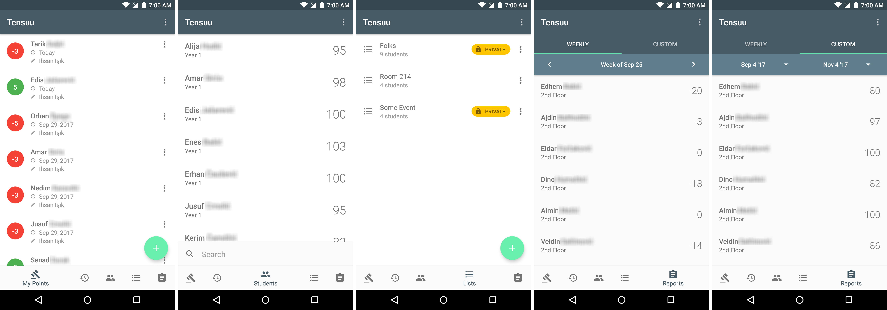

<p align="center">

</p>

<h3><p align="center">Tensuu</p></h3>

<p align="center"><i>A real-time, collaborative, points management app for Android with Realm Mobile Platform at its core.
</i></p>


<a href='https://www.youtube.com/watch?v=qVp7_TBTd_Y'></a>
<p align="right">
<a href='https://f.ikxip.me/Tensuu-demo-v1.0.0.apk'></a>
<br>
<b>Credentials</b>: admin@admin.com:admin
</p>

## What is this?
In the dormitory I work at, we have a points system for students where they get positive or negative points depending on their behavior and get awarded or sanctioned in two-month cycles. Every "supervisor" noting down the points they give in their own way and one person collecting and doing the math at the end of every week was obviously very tedious and prone to errors.

It was when I was sitting there doing something random on the Firebase Console the other day that I got the idea of using its database functionality for some kind of a points management app. Firebase's incapability as a database solution soon had me looking for an alternative. I knew of [Realm Mobile Platform](https://realm.io/products/realm-mobile-platform/), but I didn't feel like hosting my own server. Regardless, I ended up walking the realm way when smashing my head on my desk started becoming too painful. It was the best thing I did on the course of this project and RMP is one of the sickest stuff out there!

## How does it work?
It's actually rather simple. We have your usual [Realm configuration](https://realm.io/docs/java/latest/#getting-started) on the client (this app) and [Realm Object Server](https://realm.io/docs/realm-object-server) hosted somewhere on the interwebs. The client interacts with the local db just like it would in any other configuration and Realm takes care of all the syncing, conflict resolution, etc. for us, without any extra code. On top of that, we have [Realm Android Adapters](https://github.com/realm/realm-android-adapters) to handle displaying data and automatic change reflection on UI with almost no code.

## Can I use it too?
Sure. You will have to deploy your own Realm Object Server, modify the code of this app, and distribute your own version thought. Please see [this](https://github.com/xiprox/Tensuu/wiki/How-To-Modify-For-Your-Own-Use) wiki page for a few potentially helpful notes. Feel free to create an issue and ask about anything.

## License
```
Copyright (C) 2017  İhsan Işık

This program is free software: you can redistribute it and/or modify
it under the terms of the GNU General Public License as published by
the Free Software Foundation, either version 3 of the License, or
(at your option) any later version.

This program is distributed in the hope that it will be useful,
but WITHOUT ANY WARRANTY; without even the implied warranty of
MERCHANTABILITY or FITNESS FOR A PARTICULAR PURPOSE.  See the
GNU General Public License for more details.
```
GPL v3 ([LICENSE](/LICENSE))

Graphics files under [Creative Commons Attribution-ShareAlike 4.0](http://creativecommons.org/licenses/by-sa/4.0)
